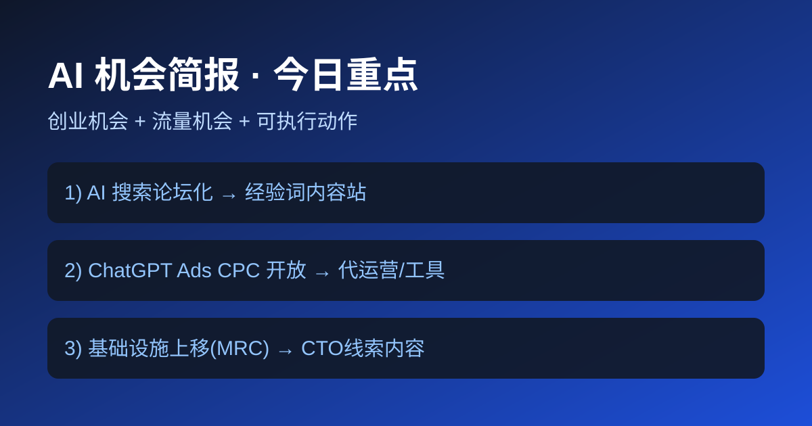
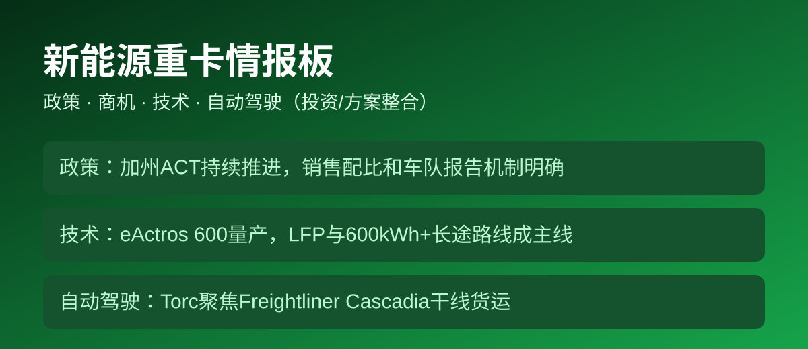

# 商用情报简报 · 2026-05-07（增强详细版）

> 用途：**AI创业机会 + 新能源重卡投资/商机/方案整合**
>
> 标准：每条信息包含「发生了什么 / 为什么重要 / 可执行动作 / 风险 / 证据等级」

**正式发布时间**：2026-05-07 06:04 UTC

## 最新数据刷新（本次）
- 本次抓取时间：2026-05-07 06:04 UTC
- OpenAI News 已刷新（含 5/6 与 5/5 相关更新）
- CARB ACT 页面已刷新（政策框架无方向性变化）
- Daimler ePortfolio 已刷新（eActros 600 与 NextGenH2 信息可见）
- Torc 官网已刷新（干线自动驾驶商业化定位延续）

---

## 总分区（大类）

### 🇨🇳 中国（大类）
- **主战场**：中文需求场景、本地车队改造、合规和交付执行。
- **优势**：需求密度高、决策链短、可快速验证。
- **短板**：部分政策与产业数据需要更多可自动抓取的一手公开源（本期已标注待补）。

### 🌍 全球（大类）
- **主战场**：平台能力变化（Ads/协议）、国际重卡路线、海外自动驾驶供应链。
- **优势**：标准化高、可复制性强。
- **短板**：自动驾驶重卡仍需第三方运营与安全数据验证，不宜只看企业口径。

---

## 板块A｜AI创业与流量机会（详细）

### A1. 关键事件拆解（不是摘要）

#### 1) ChatGPT Ads：进入“可规模化投放”阶段（A）
- **发生了什么**：OpenAI披露广告体系从试点走向更广泛可用，支持自助管理、CPC与转化测量。
- **为什么重要**：广告从“展示实验”进入“效果优化”阶段，意味着可做可复用服务与工具。
- **创业动作**：
  - 服务：`ChatGPT Ads开户+投放+归因`（标准套餐）
  - 工具：`对话广告素材生成 + ROI看板`
  - 内容：`CPC实操指南 + 常见报错与审核手册`
- **关键风险**：平台仍在迭代，规则变化快；需保留实验预算。
- **适配对象**：出海SaaS、电商工具、教育和B2B线索业务。

#### 2) AI搜索“论坛化”增强（A-）
- **发生了什么**：Google AI结果更强调论坛/社区观点（perspectives）。
- **为什么重要**：流量入口从“百科式答案”转向“经验可信度竞争”。
- **创业动作**：
  - 做“经验型词库”：对比词、避坑词、真实案例词。
  - 页面结构：问题→方案→踩坑→成本→结论。
  - 建立UGC证据区：截图/对话/操作日志。
- **关键风险**：论坛噪音与错误信息会反噬；需人工审校。

#### 3) MRC协议公开：AI基建内容机会（A）
- **发生了什么**：OpenAI发布MRC网络协议并关联OCP规范。
- **为什么重要**：基础设施标准化加速，技术解读需求上升。
- **创业动作**：
  - 内容资产：MRC词条、协议图解、场景FAQ。
  - 商务资产：面向CTO的“AI网络选型咨询入口”。
- **关键风险**：受众偏B端，转化周期相对更长。

### A2. 中国 / 全球 详细执行路径

| 分类 | 机会重心 | 本周动作 | 预期产出 |
|---|---|---|---|
| 中国 | 中文经验词流量 + 本地交付服务 | 发5篇中文实操页，建20个问答词页 | 首批自然流量与线索表单 |
| 全球 | Ads与基础设施英文趋势跟进 | 发3篇英文对照页（Ads/CPC/MRC） | 海外长尾词曝光与咨询入口 |

### A3. 可商用执行清单（48小时）
1. 上线专题页：`ChatGPT Ads CPC实战`（含预算模板下载）。
2. 上线专题页：`AI Overview流量迁移打法`（含词包）。
3. 上线专题页：`MRC协议商业含义`（CTO向）。
4. 每页加CTA：预约30分钟诊断。

### A4. 交叉验证（AI）
| 结论 | 一级来源 | 二级来源 | 状态 |
|---|---|---|---|
| Ads支持CPC与测量 | OpenAI官方公告 | 同体系工具入口 | ✅ |
| AI搜索增强perspectives | Google博客（由媒体引用） | TechCrunch解读 | ✅ |
| MRC发布并开放 | OpenAI工程文 | OCP链接 | ✅ |

---

## 板块B｜新能源重卡（政策/商机/技术/自动驾驶）详细

### B1. 政策详细解读（投资向）

#### 1) 加州ACT路径清晰（A）
- **发生了什么**：ACT包含制造商零排放销售比例提升与车队报告机制。
- **为什么重要**：这是“刚性需求制造器”，会持续推动车队升级与配套服务。
- **投资含义**：优先看“合规+运营效率”双轮公司，而非单点硬件。
- **落地机会**：
  - 车队合规数据中台
  - 路线与补能协同优化
  - TCO评估与改造实施

#### 2) 减排目标与交通电动化绑定（A）
- **发生了什么**：监管目标要求运输端持续降排。
- **为什么重要**：决定了项目不是短期风口，而是中长期结构机会。
- **投资含义**：持续性服务收入（SaaS+实施）优于一次性项目。

### B2. 商机详细拆解

| 商机 | 客户痛点 | 收费模型 | 进入门槛 |
|---|---|---|---|
| 车队电动化咨询实施 | 不知道先改哪条线路、怎么配电 | 项目费+年度顾问费 | 中 |
| 调度+补能协同软件 | 充电窗口与派车冲突 | 订阅费（按车队规模） | 中高 |
| 合规报送工具 | 多法规、多报表、易出错 | SaaS年费+实施费 | 低中 |

### B3. 技术详细情况

#### 1) 长途纯电重卡进入量产交付（B+）
- **事实点**：Daimler公开eActros 600量产与交付进展，强调高电量与长途场景。
- **对方案整合的意义**：
  - 需要把车辆、补能、线路、运营系统一体设计。
  - 单车采购思维要升级为“车队系统工程”。

#### 2) 主机厂矩阵扩张（B）
- **事实点**：Volvo电动重卡场景持续扩展。
- **意义**：多车型并行意味着“选型和运维平台化”价值提升。

### B4. 自动驾驶重卡详细情况

#### 干线自动驾驶（B-，谨慎）
- **事实点**：Torc公开其在干线货运自动驾驶方向布局。
- **商机判断**：
  - 可提前布局仿真、安全评测、车路协同数据服务。
  - 但不建议仅凭企业口径做重仓投资。
- **本期缺口**：第三方里程、安全事故率、监管批文颗粒度数据不足。

### B5. 中国 / 全球（重卡）

| 分类 | 政策与市场节奏 | 机会优先级 | 当前建议 |
|---|---|---|---|
| 中国 | 场景密集、执行快，需持续补全高质量公开数据源 | 车队改造/补能/合规工具优先 | 先做试点样板，再复制 |
| 全球 | ACT等规则驱动明确，主机厂路线公开度高 | 咨询+软件+数据服务并行 | 先切政策明确地区 |

### B6. 商用级交叉验证矩阵（重卡）

| 主题 | 一级来源（监管/官方） | 二级来源（行业/媒体） | 结论 |
|---|---|---|---|
| 政策（ACT） | CARB项目页+Fact Sheet | - | ✅ 强 |
| 技术路线 | Daimler官方ePortfolio | Volvo官方电动页 | ✅ 中强 |
| 自动驾驶 | Torc官方页 | 第三方证据不足 | ⚠️ 待补强 |

---

## 投资决策建议（本期）

### 立即推进（高确定性）
1. **重卡电动化实施服务**（咨询+交付）
2. **合规报送数据产品**（SaaS化）
3. **AI流量内容资产**（经验词站）

### 观察推进（中确定性）
1. 自动驾驶重卡生态配套（先轻资产切入）
2. 英文市场AI广告代投（建立案例后放大）

---

## 来源

### AI
- https://openai.com/index/new-ways-to-buy-chatgpt-ads/
- https://openai.com/index/mrc-supercomputer-networking/
- https://techcrunch.com/2026/05/06/google-updates-ai-search-to-include-expert-advice-from-reddit-and-other-web-forums/

### 新能源重卡
- https://ww2.arb.ca.gov/our-work/programs/advanced-clean-trucks
- https://ww2.arb.ca.gov/resources/fact-sheets/advanced-clean-trucks-fact-sheet
- https://www.daimlertruck.com/en/innovation/powertrain/our-eportfolio
- https://www.volvotrucks.com/en-en/trucks/electric.html
- https://torc.ai/
