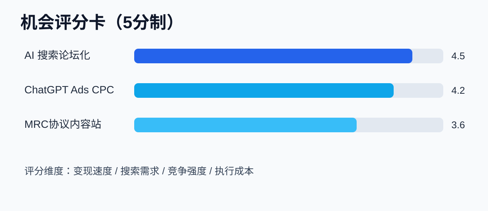

# AI 机会简报 · 2026-05-07

## 结论（先看这个）

- **优先做**：AI 搜索论坛化相关内容站（经验词/对比词/避坑词）
- **第二优先**：ChatGPT Ads CPC 教程+代运营服务页
- **第三优先**：MRC 协议解读词库（拿 CTO/B2B 线索）

## 机会总表（可直接执行）

| 方向 | 创业机会 | 流量机会关键词 | 今日动作 |
|---|---|---|---|
| AI 搜索论坛化 | 垂直经验问答站 | ai overview perspectives / reddit ai search | 发1篇“经验词”专题 + 20个问答词页 |
| ChatGPT Ads CPC | 代投+文案优化工具 | chatgpt ads cpc / chatgpt ads roi | 发1篇投放清单 + 1个ROI计算页 |
| MRC 协议 | 基础设施解读站 | mrc protocol / multipath reliable connection | 发1篇术语图解 + 1页FAQ |

## 新词清单（今天就建页）

| 新词 | 页面标题建议 |
|---|---|
| ChatGPT Ads CPC | ChatGPT Ads CPC 是什么？怎么投放最省钱 |
| AI Overview perspectives | AI Overview perspectives 对SEO的影响 |
| MRC protocol | MRC Protocol 全解：AI超算网络新标准 |
| Prompt migration | Prompt Migration：旧提示词升级实战 |
| Open-weight frontier model | Open-weight 前沿模型怎么商业化 |

## 24小时执行清单

1. 上线 3 篇文章（搜索论坛化 / ChatGPT Ads / MRC）。
2. 每篇带一个“可下载模板”（清单或SOP）提升留资。
3. 首页加 CTA：`领取AI机会清单（每日报）`。

## 参考来源

- https://techcrunch.com/2026/05/06/google-updates-ai-search-to-include-expert-advice-from-reddit-and-other-web-forums/
- https://openai.com/index/new-ways-to-buy-chatgpt-ads/
- https://openai.com/index/gpt-5-5-instant/
- https://openai.com/index/mrc-supercomputer-networking/
- https://techcrunch.com/2026/05/06/deepseek-could-hit-45b-valuation-from-its-first-investment-round/
